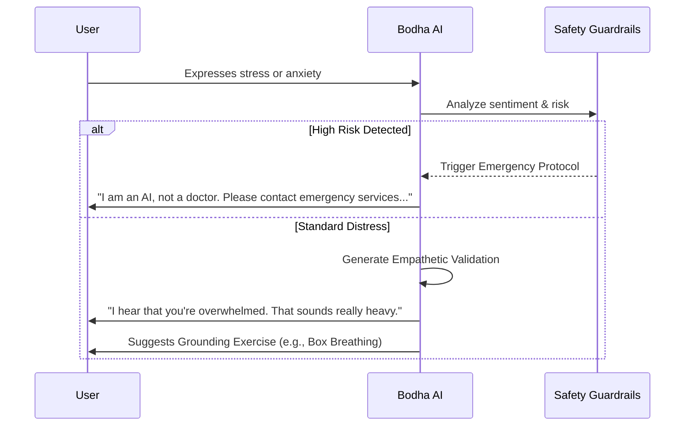

<div align="center">
  
</div>

<div align="center">
  
  
  
  
</div>

<br />

<div align="center">
  <h3>🧠 Project Evolution: MindCare+ ➡️ Bodha AI</h3>
  <p>
    <b>Bodha AI</b> represents a generational leap from its predecessor, <i>MindCare+</i>. While the original focused on text-based therapy assistance, Bodha AI introduces <b>multimodal interaction (Voice + Text)</b> powered by real-time streaming technology to create a more grounded, human-like presence for emotional self-reflection.
  </p>
</div>

---

## 🏗️ System Architecture

Bodha AI utilizes a sophisticated pipeline enabling low-latency voice interaction. Below is the high-level data flow from the user to the AI agent.


graph TD
    User([👤 User]) -->|Microphone Input| FE[💻 Frontend / Client]
    FE -->|WebRTC Stream| LK[📡 LiveKit Server]
    
    subgraph "Backend Agent"
    LK <-->|Audio Packet| AG[🤖 Python Agent]
    AG -->|Audio Stream| VAD[🔈 Voice Activity Detection]
    VAD -->|User Speech| STT[📝 STT Model]
    STT -->|Transcribed Text| LLM[🧠 LLM Reasoning Engine]
    LLM -->|Response Text| TTS[🗣️ TTS Model]
    TTS -->|Synthesized Audio| AG
    end
    
    AG -->|Response Audio| LK
    LK -->|Playback| FE
    FE -->|Audio Output| User

```

---

## 🔁 Interaction Workflow

The system is designed to handle sensitive conversations with empathy. The logic flow prioritizes validation before offering grounding techniques.



---

## 🌟 Core Features

| Feature | Description | Tech Component |
| --- | --- | --- |
| **🗣️ Real-Time Voice** | Natural, interruptible voice conversations with < 500ms latency. | LiveKit, WebRTC |
| **💬 Emotion Awareness** | Responses are tuned for empathy, reflection, and validation rather than generic advice. | Prompt Engineering |
| **🧘 Wellness Tools** | Built-in scripts for guided mindfulness, breathing exercises, and stress grounding. | Agent Logic |
| **🔐 Privacy-First** | No database storage of conversations. Context is ephemeral and session-scoped. | Ephemeral Memory |
| **🛡️ Safety Guardrails** | Strict system prompts prevent the AI from making medical diagnoses or prescriptions. | System Instructions |

---

## 🛠️ Technical Implementation

**Bodha AI** is built to demonstrate the capability of modern Real-Time AI agents in healthcare-adjacent fields.

* **Orchestration:** Python (Async/Await)
* **Real-Time Transport:** LiveKit (WebRTC wrapper)
* **Speech-to-Text (STT):** Deepgram / OpenAI Whisper
* **Text-to-Speech (TTS):** ElevenLabs / OpenAI TTS
* **Intelligence:** LLM (Llama 3 / GPT-4o) via OpenAI API standard

### Key Engineering Challenges Solved

1. **Latency Reduction:** Optimized the VAD (Voice Activity Detection) to minimize the "awkward pause" between user speech and AI response.
2. **Interruption Handling:** Implemented logic allowing the user to cut the AI off mid-sentence, mimicking natural human conversation flow.
3. **Tone consistency:** Tuned system prompts to maintain a calm, non-judgmental "therapist-like" persona.

---

## ❗ Important Ethical Disclaimer

> [!WARNING]
> **Bodha AI is NOT a licensed medical provider.**
> This application is an **academic prototype** designed to explore Human-Computer Interaction (HCI) in emotional wellness.
> * It cannot diagnose mental health conditions.
> * It cannot prescribe medication.
> * It is not a replacement for professional therapy.
> 
> 
> **If you are in crisis, please contact your local emergency services immediately.**

---

<div align="center">
<h3>👤 Author</h3>
<p>
<b>Vishva Teja Guduguntla</b>


<i>AI & Healthcare Systems Enthusiast</i>
</p>
<p>
<a href="https://linkedin.com/in/vishva-teja-guduguntla">

</a>
<a href="https://www.google.com/search?q=https://github.com/vishva-teja">

</a>
</p>


<h5>🧭 Note: Bodha AI exists to demonstrate responsible AI design, system thinking, and ethical awareness in emotionally sensitive domains.</h5>
</div>

```

```
